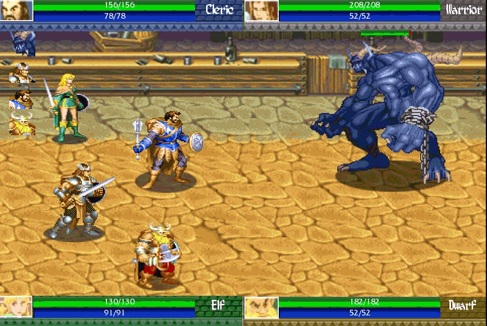
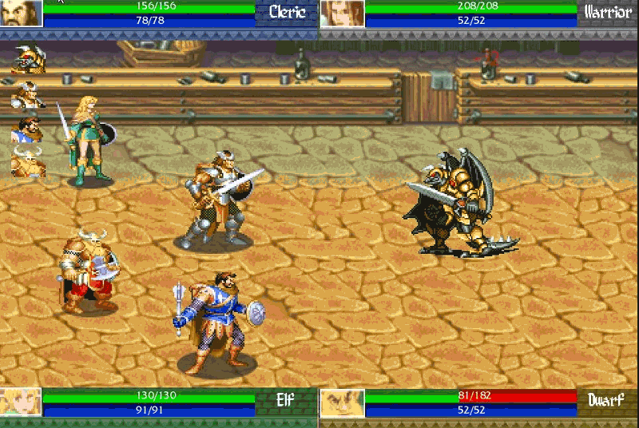
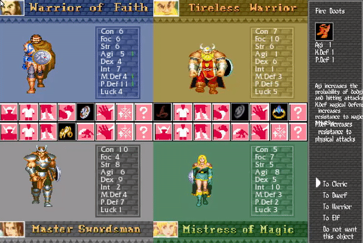
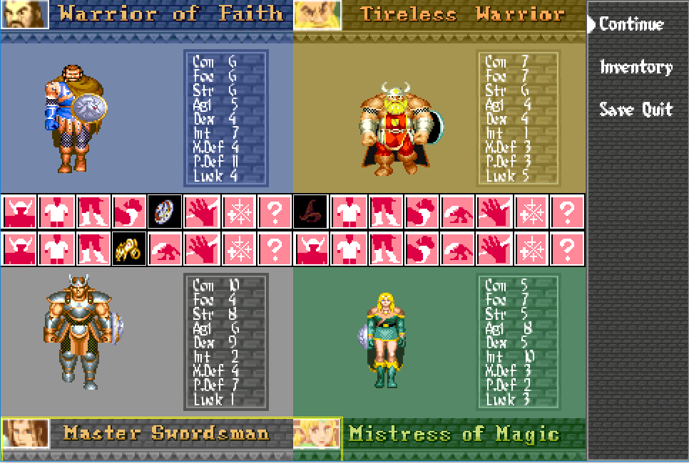

As a responsible or UI i had to organise how to made ui to be intuitive. In a turn based game like this, it was difficult because the game have a lot of information and it was difficult to reach something clear and esy to understand.
My work in this project have been focused on programming, but i also made some things of art (most of them of UI). I've done:

* UI sprites for combat, loot menu and pause menu
* Implement a task manager to manage all the combat
* Implement a cutscene manager. You can find more detailed explanation about that cutscene manager [here](https://acaree.github.io/Cutscene-manager/)
* Two bosses: the Dark Warrior and Silumgar, the final boss. This include abilities & AI.
* Some abilities of the heroes and bosses
* High implication in design of the game.
* Take some sprites
* Test, bug solving and balancing.

_Combat with task manager and some UI_

_Dark Warrior_

_Silumgar_

_Loot menu and pause menu_

[Back](https://wilhelman.github.io/DD-Wrath-of-Silumgar/)
