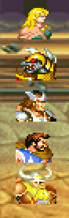
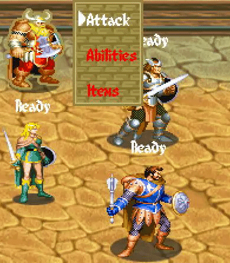
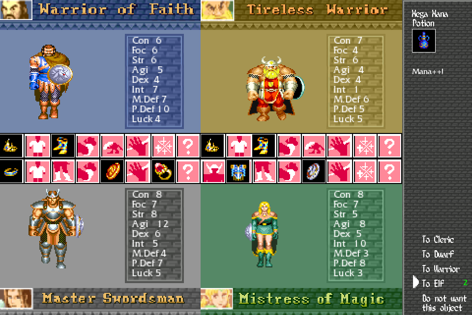
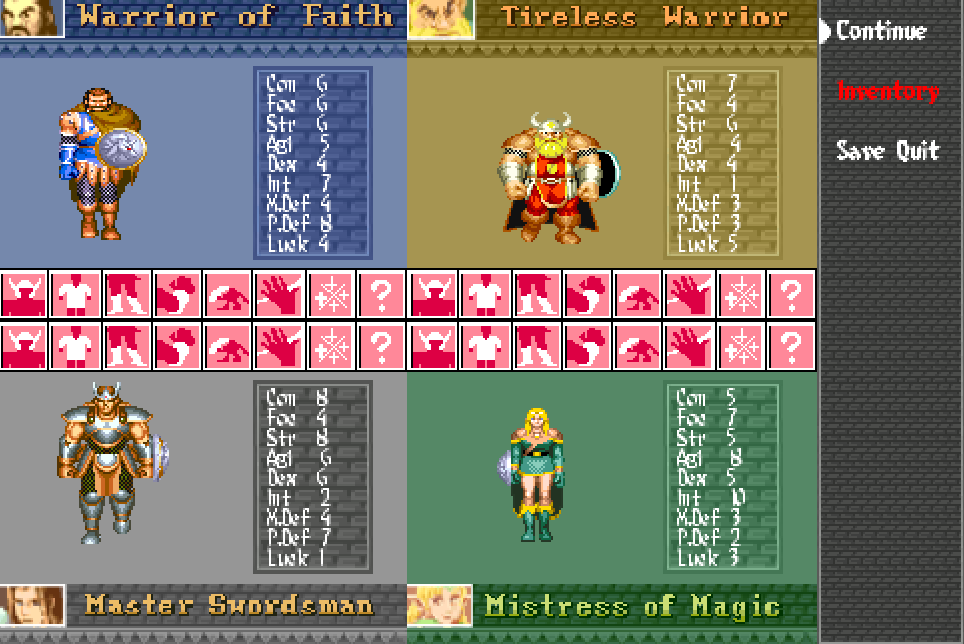
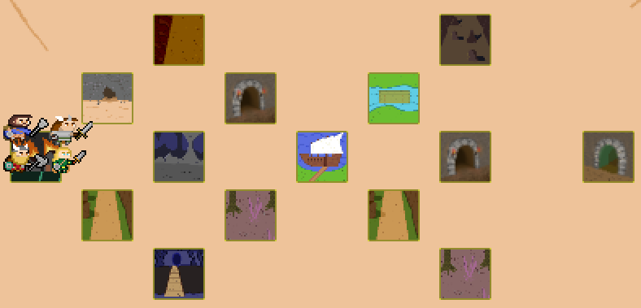

# Alfonso Sanchez-Cortes Puerta  

I'm the project's programming leader. My role in the project has been to maintain a good code and a good structure. In addition to answer any questions that may arise to the other collaborators of the project.
Apart from programming, I've also been responsible for part of the design of the game, some art and to look for bugs apart from solving them. I've done:

* [Technical design document](https://github.com/Wilhelman/DD-Wrath-of-Silumgar/wiki/Tech-Design-Document).
* Some of the parts of the combat scene:  
	* Priority Queue to combat.  
	
	* Priority Draw to entity.  
	
	* Logic of combat: attack, statistics and lose life.  
* Change all SDL to STL in code.
* Solve problems and cleaning UI.  
* All particle system and all particles in game.  

* Solve problems with FullScreen.  
* Logic of decision.    
* Loot Menu.
    
* Pause Menu.  
  
* Some abilities of the heroes.  
* Map structure.  

* High implication in design and balancing of the game. 

[Back](https://wilhelman.github.io/DD-Wrath-of-Silumgar/)